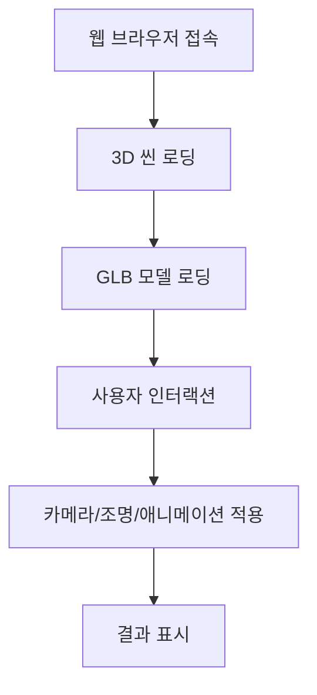

# Maserati 3D Gallery

## 목차
- [프로젝트 소개](#1-프로젝트-소개)
- [시연](#2-시연)
- [기술 스택](#3-기술-스택)
- [주요 기능](#4-주요-기능)
- [기능 흐름도](#5-기능-흐름도)
- [기능 및 핵심 구현 사항](#6-기능-및-핵심-구현-사항)
- [설치 및 실행 방법](#7-설치-및-실행-방법)
- [프로젝트 구조](#8-프로젝트-구조)
- [성능 최적화](#9-성능-최적화)
- [트러블슈팅](#10-트러블슈팅)
- [향후 계획](#11-향후-계획)

---

## 1. 프로젝트 소개
**Maserati 3D Gallery**는 Three.js와 React Three Fiber를 활용하여 마세라티 자동차 모델을 인터랙티브하게 탐색할 수 있는 3D 가상 전시장을 구현합니다. 사용자는 GLB 모델로 세밀한 자동차 디테일을 확인하면서, 배경 환경 속에서 다양한 장면을 체험할 수 있어요.
<br />
단풍 숲을 달리는 마세라티, 도심 속 우아하게 움직이는 마세라티, 드라이브 중인 마세라티 등 여러 환경에서 자동차가 보여주는 느낌을 바로 확인할 수 있습니다.  
그냥 입체적인 자동차 모델을 보는 게 아니라, 자동차와 환경을 함께 “체험”하는 재미를 주는 프로젝트입니다.<br />

## 2. 시연
  
- 3D 모델 회전 및 확대/축소
- 카메라 시점 이동
- 조명/환경 변경
- UI 인터랙션

## 3. 기술 스택
- **React:** 사용자 인터페이스 구축
- **Three.js:** 웹 브라우저 3D 그래픽 구현
- **React Three Fiber (R3F):** Three.js를 React 컴포넌트 형식으로 활용
- **drei:** R3F용 유틸리티 라이브러리(조명, 카메라, 모델 로딩 등)
- **GLB 3D 모델:** 실제 자동차와 비슷한 3D 모델링 파일
- **Suspense:** 모델 및 컴포넌트 지연 로딩
- **Tailwind CSS:** 유틸리티 기반 UI 개발
- **Vite:** 빠른 개발 환경
- **ESLint & Prettier:** 코드 품질 및 스타일 유지

## 4. 주요 기능
- 3D 모델 회전 및 확대/축소
- 카메라 시점 이동
- 조명/환경 변경
- UI 인터랙션(버튼, 메뉴 등)

## 5. 기능 흐름도


## 6. 기능 및 핵심 구현 사항

* **3D 모델 전시:** 두 가지 마세라티 모델을 GLB 형식으로 고품질 3D 전시
* **인터랙티브 커스터마이징:**  
  - **색상 변경:** 차량 외관 색상 선택  
  - **캘리퍼 변경:** 브레이크 캘리퍼 디자인 조정  
  - **배경 변경:** 단풍 숲, 도시, 드라이브 등 다양한 이미지 배경 적용  
* **모델 탐색:** 마우스 드래그로 회전, 휠로 확대/축소 가능 (OrbitControls 활용)  
* **쉽고 직관적인 내비게이션:** NavBar로 모델 선택, SideMenu로 커스터마이징
* 
---

## 핵심 구현 사항

* **GLB 모델 최적화:** 고용량 3D 모델을 효율적으로 로딩  
* **현실감 있는 렌더링:** HDR 환경맵과 금속·유리 질감으로 사실감 구현  
* **React Three Fiber + drei 활용:** 3D 씬 구성, 조명/카메라/모델 로딩 간편화  
* **Suspense & React.lazy:** 모델과 컴포넌트 지연 로딩으로 초기 성능 최적화  


## 7. 설치 및 실행 방법

1.  **저장소 클론:**
    ```bash
    git clone [https://github.com/yeaseula/Maserati-3D-Gallery]
    cd maserati
    ```
2.  **의존성 설치:**
    ```bash
    npm install
    # 또는 yarn을 사용하는 경우:
    # yarn install
    ```
3.  **개발 서버 실행:**
    ```bash
    npm run dev
    # 또는 yarn을 사용하는 경우:
    # yarn dev
    ```
4.  **바로가기**

   [Maserati 3D Gallery](https://maserati-3d-gallery.netlify.app/)


## 8. 프로젝트 구조
