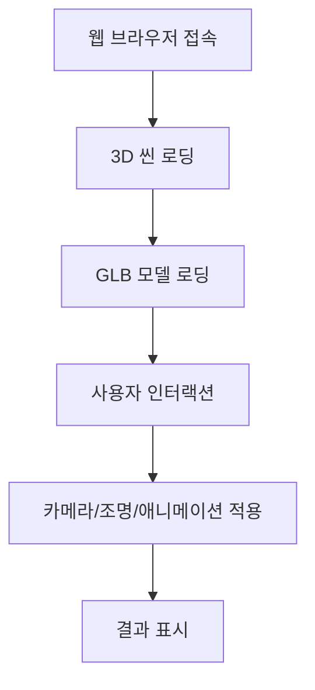

# Maserati 3D Gallery

## 목차
- [프로젝트 소개](#1-프로젝트-소개)
- [시연](#2-시연)
- [기술 스택](#3-기술-스택)
- [주요 기능](#4-주요-기능)
- [기능 흐름도](#5-기능-흐름도)
- [기능 및 핵심 구현 사항](#6-기능-및-핵심-구현-사항)
- [설치 및 실행 방법](#7-설치-및-실행-방법)
- [프로젝트 구조](#8-프로젝트-구조)
- [트러블슈팅](#9-트러블슈팅)
- [느낀 점](#10-느낀-점)

---

## 1. 프로젝트 소개
**Maserati 3D Gallery**는 Three.js와 React Three Fiber를 활용하여 마세라티 자동차 모델을 인터랙티브하게 탐색할 수 있는 3D 가상 전시장을 구현합니다. 사용자는 GLB 모델로 세밀한 자동차 디테일을 확인하면서, 배경 환경 속에서 다양한 장면을 체험할 수 있습니다.
<br />
단풍 숲을 달리는 마세라티, 도심 속 우아하게 움직이는 마세라티, 드라이브 중인 마세라티 등 여러 환경에서 자동차가 보여주는 느낌을 바로 확인할 수 있습니다.  
그냥 입체적인 자동차 모델을 보는 게 아니라, 자동차와 환경을 함께 “체험”하는 재미를 주는 프로젝트입니다.<br />

## 2. 시연
  
- 3D 모델 회전 및 확대/축소
- 카메라 시점 이동
- 조명/환경 변경
- UI 인터랙션

## 3. 기술 스택
- **React:** 사용자 인터페이스 구축
- **Three.js:** 웹 브라우저 3D 그래픽 구현
- **React Three Fiber (R3F):** Three.js를 React 컴포넌트 형식으로 활용
- **drei:** R3F용 유틸리티 라이브러리(조명, 카메라, 모델 로딩 등)
- **GLB 3D 모델:** 실제 자동차와 비슷한 3D 모델링 파일
- **Suspense:** 모델 및 컴포넌트 지연 로딩
- **Tailwind CSS:** 유틸리티 기반 UI 개발
- **Vite:** 빠른 개발 환경
- **ESLint & Prettier:** 코드 품질 및 스타일 유지

## 4. 주요 기능
- 3D 모델 회전 및 확대/축소
- 카메라 시점 이동
- 조명/환경 변경
- UI 인터랙션(버튼, 메뉴 등)

## 5. 기능 흐름도


## 6. 기능 및 핵심 구현 사항

* **3D 모델 전시:** 두 가지 마세라티 모델을 GLB 형식으로 고품질 3D 전시
* **인터랙티브 커스터마이징:**  
  - **색상 변경:** 차량 외관 색상 선택  
  - **캘리퍼 변경:** 브레이크 캘리퍼 디자인 조정  
  - **배경 변경:** 단풍 숲, 도시, 드라이브 등 다양한 이미지 배경 적용  
* **모델 탐색:** 마우스 드래그로 회전, 휠로 확대/축소 가능 (OrbitControls 활용)  
* **쉽고 직관적인 내비게이션:** NavBar로 모델 선택, SideMenu로 커스터마이징
* 
---

## 핵심 구현 사항

* **GLB 모델 최적화:** 고용량 3D 모델을 효율적으로 로딩  
* **현실감 있는 렌더링:** HDR 환경맵과 금속·유리 질감으로 사실감 구현  
* **React Three Fiber + drei 활용:** 3D 씬 구성, 조명/카메라/모델 로딩 간편화  
* **Suspense & React.lazy:** 모델과 컴포넌트 지연 로딩으로 초기 성능 최적화  


## 7. 설치 및 실행 방법

1.  **저장소 클론:**
    ```bash
    git clone [https://github.com/yeaseula/Maserati-3D-Gallery]
    cd maserati
    ```
2.  **의존성 설치:**
    ```bash
    npm install
    # 또는 yarn을 사용하는 경우:
    # yarn install
    ```
3.  **개발 서버 실행:**
    ```bash
    npm run dev
    # 또는 yarn을 사용하는 경우:
    # yarn dev
    ```
4.  **바로가기**

   [Maserati 3D Gallery](https://maserati-3d-gallery.netlify.app/)


## 8. 프로젝트 구조
```
.
└── maserati/
    ├── components/
    │   ├── canvas/
    │   │   ├── CarModel.jsx
    │   │   ├── Light.jsx
    │   │   └── Wall.jsx
    │   ├── CalliperChanger.jsx
    │   ├── ChangerButton.jsx
    │   ├── ChangerMenu.jsx
    │   ├── ColorChanger.jsx
    │   ├── ModelDescript.jsx
    │   ├── NavBar.jsx
    │   ├── SideMenu.jsx
    │   └── WindowChanger.jsx
    ├── pages/
    │   └── Showroom.jsx
    ├── public/
    │   ├── glb/
    │   ├── hdr/
    │   └── image/
    ├── src/
    │   ├── App.css
    │   ├── App.jsx
    │   ├── index.css
    │   └── main.jsx
    ├── index.html
    ├── package.json
    ├── postcss.config.js
    ├── tailwind.config.js
    └── vite.config.js
```
## 9. 트러블슈팅

## Three.js 관련

### 1. 3D 모델 로딩 속도 문제
- **문제**: 고해상도 GLTF/GLB 모델 불러올 때 로딩이 길고 초기 화면 진입이 늦음.  
- **해결**: 불필요한 geometry/material 제거 및 Suspense의 fallback을 활용해 로딩 애니메이션 노출

### 2. 재질(Material) 표현 어려움
- **문제**: 유리·금속 질감이 의도와 다르게 표현됨.  
- **해결**:  
  - 유리창 → `transmission`, `ior`, `opacity`, `thickness` 조정.  
  - 차체 → `metalness`, `roughness` 조정 후 `environmentMap` 반사 적용.

### 3. 조명 세팅 문제
- **문제**: 스팟라이트만 사용 시 반사가 과도하거나 차량 일부가 너무 어두움.  
- **해결**:
  - 기존 스팟라이트 위치·강도 조정 → 전체적으로 은은한 골드톤 연출
  - 차체/유리 반사 대비 조명 톤 세밀하게 맞춤
  - 복잡하게 광원 혼합하지 않고 기존 스폿라이트 세팅만으로 해결

### 4. 투명/굴절 표현 문제
- **문제**: 유리창 뒤 물체가 어둡거나 왜곡됨.  
- **해결**: `MeshPhysicalMaterial`의 `transmission`, `ior`, `envMapIntensity` 최적화.

### 5. 성능 최적화 이슈
- **문제**: 고해상도 모델·조명·애니메이션 때문에 FPS 저하.  
- **해결**:  `dracoLoader`로 모델 압축 (13.6MB -> 4.3MB)

### 6. 에셋 불러오기 에러
- **문제**: `Uncaught Error: Could not load /src/assets/images/...` 발생.  
- **해결**: 정적 파일은 모두 `public/` 폴더로 옮기고 `/images/...` 경로 사용.

## React 관련

### 7. 라우트 전환 시 화면 깜빡임
- **문제**: 페이지 이동 시 전체 화면이 새로고침처럼 깜빡임. (Three.js Canvas 리마운트 문제)  
- **원인**: `<Route element>`에 `key` 속성이 매번 달라져 컴포넌트가 언마운트/리마운트됨.  
- **해결**: `useLocation` 훅 활용해 애니메이션 전환 처리, 3D Canvas 유지.

### 8. 정적 파일 경로 문제
- **문제**: `/src/assets` 내부 이미지는 빌드 시 경로 문제로 로드 실패.  
- **해결**: 모든 아이콘/이미지는 `public/`으로 이동, 절대 경로로 관리.

## Tailwind 관련

### 9. Tailwind 동적 클래스명 적용 문제
- **문제**: CDN에서는 `className={`bg-${color}-500`}`처럼 동적 클래스 적용 가능했으나, npm 설치 후 빌드하면 PurgeCSS 때문에 무시됨.  
- **해결**: 배경 색상/이미지만 필요했기 때문에 inline style로 대체:  
```jsx
<div style={{ backgroundColor: color }}></div>
```

## 10. 느낀 점

처음 Three.js를 배우고, React Fiber 문법을 적용하는 과정에서 예상치 못한 문제가 많았다.
순수 자바스크립트에서는 없던 오류가 Fiber 문법에서 발생하기도 했고, 하나씩 차근차근 익히는 데 시간이 필요했다.
<br />
GLB 모델 선택도 쉽지 않았다.
외관뿐 아니라 내부까지 사실적으로 구현된 모델을 고르다 보니 용량 문제는 피할 수 없었고, draco 압축 후에도 4MB라는 용량은 부담이었다.
또, 메쉬 재질의 특성을 이해해야 하므로 기술적 이해와 미적 감각이 동시에 요구되었다.
<br />
이번 프로젝트는 단순 기능 구현을 넘어 물리적 특성 + 시각적 감각 + 기능 구현 센스까지 요구되는 까다로운 작업이었다.
아직 Three.js의 많은 기능을 활용하지 않았음에도, 학습한 내용이 상당했고 앞으로 배울 내용이 많다는 것을 실감했다.
<br />
결론적으로 처음 시도하는 React + Tailwind + Three.js 조합은 신선했고, 흥미로운 경험을 했다.


